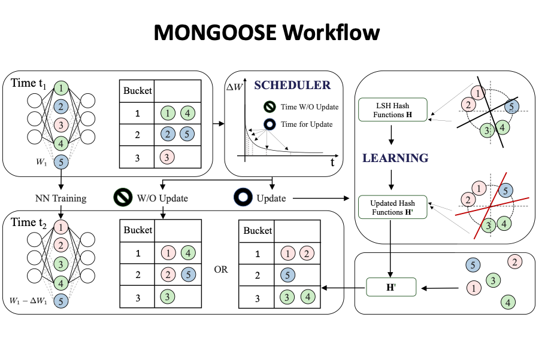

# MONGOOSE

> **MONGOOSE: A Learnable LSH Framework for Efficient Neural Network Training**\
> Beidi Chen, Zichang Liu, Binghui Peng, Zhaozhuo Xu, Jonathan Lingjie Li, Tri Dao, Zhao Song, Anshumali Shrivastava, Christopher Ré\
> Stanford University, Rice University, Columbia University, Princeton University\
> Paper: https://openreview.net/pdf?id=wWK7yXkULyh


> **Abstract.** Recent advances by practitioners in the deep learning community have breathed
new life into Locality Sensitive Hashing (LSH), using it to reduce memory and
time bottlenecks in neural network (NN) training. However, while LSH has sublinear guarantees for approximate near-neighbor search in theory, it is known to
have inefficient query time in practice due to its use of random hash functions.
Moreover, when model parameters are changing, LSH suffers from update overhead. This work is motivated by an observation that model parameters evolve
slowly, such that the changes do not always require an LSH update to maintain
performance. This phenomenon points to the potential for a reduction in update
time and allows for a modified learnable version of data-dependent LSH to improve query time at a low cost. We use the above insights to build MONGOOSE, an
end-to-end LSH framework for efficient NN training. In particular, MONGOOSE
is equipped with a scheduling algorithm to adaptively perform LSH updates with
provable guarantees and learnable hash functions to improve query efficiency.
Empirically, we validate MONGOOSE on large-scale deep learning models for recommendation systems and language modeling. We find that it achieves up to 8%
better accuracy compared to previous LSH approaches, with 6.5× speed-up and
6× reduction in memory usage.

## Setup

### Requirements
This repository requires Python 3.6+ and Pytorch 1.5+.
For simplicity, please refer to the our Dockerfile with all environments installed. Build docker:
```
docker build -f Dockerfile .
```
or pull it with:
```
docker pull beidichen1993/mongoose:latest
```

## Experiments
MONGOOSE is built on top of two existing frameworks: SLIDE and Reformer.
 
* For SLIDE part, the original framework is in C++ ([SLIDE](https://github.com/keroro824/HashingDeepLearning)). We implement a pytorch version with customized LSH library in `lsh_lib`. We are working on a 2nd update that will release this part.
* For Reformer part, we adapted code from [reformer-pytorch](https://github.com/lucidrains/reformer-pytorch) repository.

### MONGOOSE on Reformer
Launch experiments with ```python mongoose_reformer/train_reformer.py```.

Run experiments on a simple MONGOOSE-Reformer language model on the `copy` task. 

```
python mongoose_reformer/train_reformer.py
# mongoose setttings
    --bucket_size_list [64, 64] # average size of qk per bucket for every layer (can vary)
    --n_hashes_list [1, 1] # number of hash rounds for every layer
    --attn_type_list ['triplet', 'triplet'] # `triplet` represents using learnable lsh in that layer; 'lsh' is normal reformer attention
    --thresh 0.01 # tolerance of triggering mongoose scheduler (ranging in [0, 1])   
    --scheduler_hashes 10 # number of hash codes used in the low-cost scheduler data structure
    
# model settings
    --seq_len 1024 
    --ntokens 16
    --emsize 256
    --nhid 256
    --nlayers 2
    --nhead 4
    --use_full_attn False # only turn on this flag to override and turn on full attention for all sequence lengths. for comparison with LSH to show that it is working
    --full_attn_thres # use full attention if context length is less than set value

# training setttings
    --epochs 30 
    --batch_size 16
    --train_batches 5000
    --eval_batches 500
```

### MONGOOSE on SLIDE
Instructions coming soon!

## Citation
If you use this codebase, or otherwise found our work valuable, please cite:
```
@inproceedings{mongoose,
    title={MONGOOSE: A Learnable LSH Framework for Efficient Neural Network Training},
    author={Beidi Chen, Zichang Liu, Binghui Peng, Zhaozhuo Xu, Jonathan Lingjie Li, Tri Dao, Zhao Song, Anshumali Shrivastava, Christopher R\'{e}},
    booktitle={International Conference on Learning Representations},
    year={2021},
    url={https://openreview.net/forum?id=wWK7yXkULyh}
}
```
